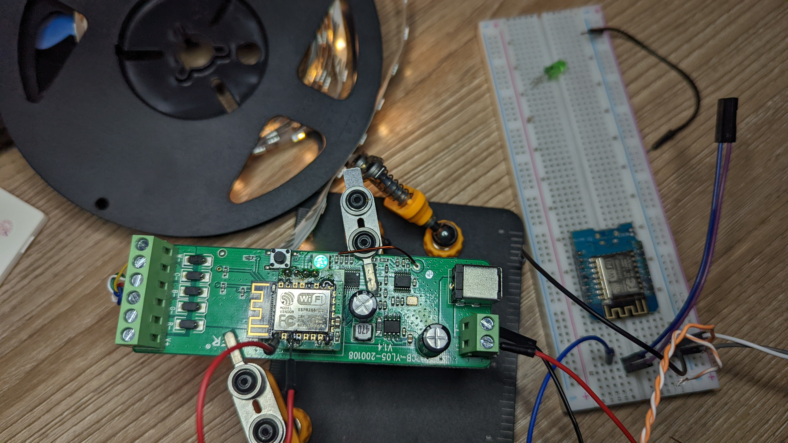
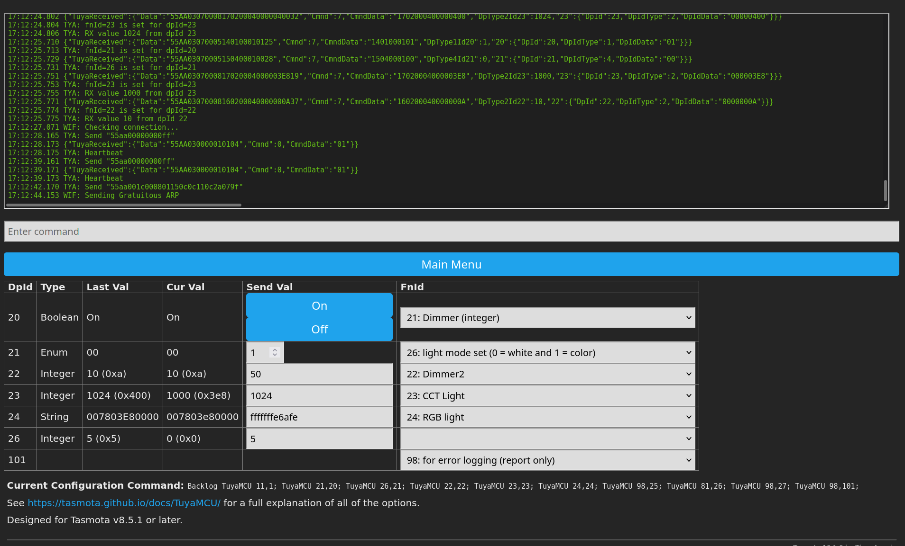
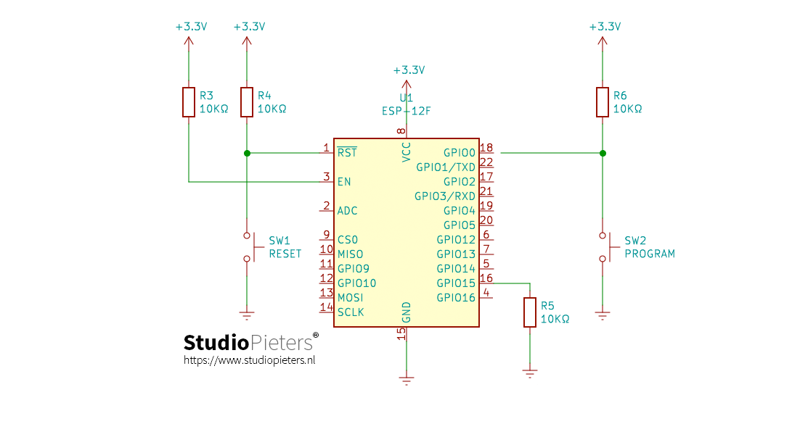

# MiBoxer MI-5 LED Controller reverse engineering

The goal: reverse engineer the protocol used for communication between the network interface and the MCU that managed the PWM signals for each LED channel.

There are two chips of significance here:

The network interface chip: [`WBR3`](https://developer.tuya.com/en/docs/iot/wbr3-module-datasheet?id=K9dujs2k5nriy)
The 'TuYa MCU': `n76e003at20`. Data sheet at [`docs/DS_N76E003_EN_Rev1.07.pdf`](docs/DS_N76E003_EN_Rev1.07.pdf)

The WBR3 has the same footprint as an ESP8266 12e style module but does not have _100%_ the same pinout.
The WBR3 module does NOT have a `RST` pin. The ESP equivalent is marked `NC`.

In testing, it appears that the `RST` chip on the WBR3 does **not** need to be pulled up for the module to boot.
This is NOT the case with an ESP module; the `EN` chip does need to be pulled up.

## What I know so far

Some things. The configuration below is not perfect but does work. I was able to set the mode to `1` (color light) and even able to change the color and ratio of color vs white via the tasmota web UI.
However, the color / brightness of the LEDs quickly gets out of sync from what the web UI thinks the state is. I am pretty sure that this is because some state / feedback only comes from whatever bytes the MCU sends via `DpId` number `101`.

| DpId | FnId                  | Notes                                                                                                                                                                                                                                                                                                                   |
| ---- | --------------------- | ----------------------------------------------------------------------------------------------------------------------------------------------------------------------------------------------------------------------------------------------------------------------------------------------------------------------- |
| 20   | 21 (integer)          | This seems to be a master on/off switch. Leds quickly fade in/out so it's a dimmer and not a instant on/off switch                                                                                                                                                                                                      |
| 21   | 26 (light mode)       | This seems to control weather or not the ww/cw leds are turned on at all. It is possible to send commands to the MCU directly which will turn on the RGB and WW/CW leds but Tasmota does not appear to support this. At least some times, the unit can be 'locked' into RGB only mode                                   |
| 22   | 22 (Dimmer2)          | This seems to be the master dimmer. Applies to all color modes.                                                                                                                                                                                                                                                         |
| 23   | 23 (CCT Light)        | This seems to be the "white" level. When configured as `Fnid 23 (CCT)` maxing this level out seems to just turn up the RGB leds to full... in some operational modes. In others, the higher the value, the more the CW channel dominates. At full (`0x3e8`) The CW channel is only on. At lowest (`0x0`) only WW is on. |
| 24   | RGB (and ww/cw) color | This does appear to use the 0HUE0SAT0BRI format. Depending on light mode, this will control RGB only or RGB+WW/CW or WW/CW.                                                                                                                                                                                             |
| 26   | 81 (Timer1)           | This is a count down timer. As long as the LEDs are on, you can set this to an integer between 1 and 4294967295 (0xffffffff). When it hits 0, lights off. Not sure if this survives power loss.                                                                                                                         |
| 101  |                       | This seems to be the global state / status of all (?) parameters on the MCU.                                                                                                                                                                                                                                            |

-------------

ESP Module soldered ot the carrier board and `RST` pulled up so it boots.

After a _lot_ of trial/error, a mostly working tasmota configuration. Sometimes, web UI sliders don't work as expected but the basics are here: color / brightness can be controlled and ww/cw can be toggled

## The 'carrier board':

Looking at the PCB that the WBR3 module sits on and looking at the pinout from the dev docs and ESP module we have:

| WBR3 Pin | ESP Pin | PCB Trace                     |
| -------- | ------- | ----------------------------- |
| EN       | CH_EN   | Pulled up to VCC via resistor |
| A_11     | N/A     | NC - Structural only          |
| A_4      | N/A     | NC - Structural only          |
| VCC      | VCC     | to 3v3                        |
| GND      | GND     | to gnd                        |
| A_12     | N/A     | NC - Structural only          |
| RXD      | U0RXD   | RXD                           |
| TXD      | U0TXD   | TXD                           |

So it becomes super clear that this is 100% a UART talking to the nuvoton IC.
This is more or less how other TuYa devices function.

## Quick note about getting the ESP module to boot

Not sure about the `WBR3` module but the ESP _does_ need both the `EN` **AND** `RST` pins pulled up.
The carrier board that the MI5 comes with only has the `EN` pin pulled up.
I struggled with this for a LONG time before taking a step back and confirming all the required pins for the right boot mode

Thanks to this source
https://www.studiopieters.nl/esp8266-auto-program-reset/

for this image

After that, I was able to get the ESP module booting.

## Quick word on ESP dev modules

Don't use them! The USB <-> UART converter that makes programming an ESP module easy is connected to the ESP module UART0.

This has the effect of pulling up the ESP RX pin to 3.3v which is higher than the RX line is when measured from the carrier board.

With nothing attached to the RX pin on the carrier board, I see about 2.6V. Scope confirms that logic 0 goes all the way to about 5mv (close enough to 0) when the MCU is communicating.

When the RX pin from a basic WeMos D1 mini was attached, the RX line was pulled all the way up to 3.3v.
When the MCU would communicate, logic low was somewhere around 2.8V... which is too high to ever register as a 0.

I spent almost a full day bashing my head against this problem until I figured it out. 
When the RX line from the various ESP dev units that I used was attached to the MiLight, neither the ESP or my logic analyser would see any communication inbound; Tasmota never fired off any `TuyaReceived` messages.

As soon as I soldered the ESP module directly to the carrier board, Tasmota started 'seeing' inbound comms.
